<p align="center">
  
</p>

<p align="center"><a href="README.md">Overview</a> · <a href="CHANGELOG.md">Changelog</a> · <a href="PRIVACY.md">Privacy</a> · <a href="SECURITY.md">Security</a></p>

[](CHANGELOG.md) · **iOS 18+** · **Free Apple ID**

# iPhone setup

[SideStore](#1-install-sidestore) · [Install tracker](#2-install-an1me-tracker) · [Enable Safari](#3-turn-the-extension-on) · [Sign in](#4-sign-in) · [Troubleshooting](#troubleshooting)

The tracker runs on iPhone as a Safari extension inside a small app. It is not on the App Store: each
release attaches an unsigned `An1meTracker-<version>.ipa`, and **SideStore** signs it with your own
free Apple ID and keeps it signed.

> [!NOTE]
> **Before you start.** You need iOS 18 or later, a free Apple ID and Wi-Fi. The first setup needs a
> Windows, macOS or Linux computer once — or none at all on iOS 27, where **SideInstaller** installs
> SideStore on the device.

## 1. Install SideStore

Follow the official guide at [docs.sidestore.io](https://docs.sidestore.io); the steps change between
versions. In short, from a Windows PC:

1. On the iPhone, install **LocalDevVPN** from the App Store.
2. On the PC, install **iTunes** and **[iloader](https://github.com/nab138/iloader/releases)**.
3. Connect the iPhone by cable, tap **Trust**, sign in with your Apple ID and install **SideStore**.
   iloader also places the pairing file SideStore needs.
4. On the iPhone: **Settings → General → VPN & Device Management** → trust your Apple ID's developer
   app; then **Settings → Privacy & Security → Developer Mode** → on, and restart.
5. Open SideStore, connect LocalDevVPN, and sign in with the same Apple ID.

## 2. Install An1me Tracker

1. In SideStore, open **Sources → +** and paste this source URL:

   ```text
   https://github.com/thomasthanos/An1me-Tracker/releases/download/tracker-source/source.json
   ```

2. Confirm the source, open **An1me.to Tracker** and tap **Install**. Keep LocalDevVPN connected while
   it installs.
3. Open the **An1me Tracker** app once.

> [!IMPORTANT]
> That URL returns JSON for **Add Source**. To install the IPA by hand instead, download
> `An1meTracker-<version>.ipa` from the [releases page](https://github.com/thomasthanos/An1me-Tracker/releases)
> and use **My Apps → +**. An IPA download URL cannot be added as a Source.

## 3. Turn the extension on

1. **Settings → Apps → Safari → Extensions → An1me.to Tracker** → turn it on.
2. Open **an1me.to** in Safari. Tap the **puzzle / AA** button in the address bar and allow the tracker
   **Always on This Website** so it can save watch progress.
3. Open **An1me.to Tracker** from that Safari menu and tap **Allow website access**, then **Allow** in Safari's
   prompt. This one tap asks for every website the tracker uses: sign-in and cloud sync, metadata, filler
   data, cover images and Skip Outro. The button is on the tracker before sign-in and in **Tracker → Settings**.
4. If Safari does not allow them, the card adds **Open Safari Settings**: it opens the An1me Tracker app, which
   takes you to the extension's page in Settings (iOS 26.2 and later; earlier versions open Settings, then go to
   **Apps → Safari → Extensions → An1me.to Tracker**). Under **Permissions**, set **All Websites** to **Allow**
   and come back to Safari: the card checks again by itself.

> [!IMPORTANT]
> Safari controls permission approval; the tracker can only ask. Its scripts run on an1me.to only; elsewhere
> it only reads the services it uses (Firebase, Jikan, AnimeFillerList, AniSkip, MyAnimeList and image hosts).
> Settings lists those services one by one and also has a single **All Websites** switch that covers them all.
> Online work stays paused until they are allowed; local progress keeps saving. AniList sync remains
> disabled on mobile.
> [Apple's Safari extension permission documentation](https://developer.apple.com/documentation/safariservices/managing-safari-web-extension-permissions)

## 4. Sign in

Google and AniList sign-in need Chrome's identity API, which Safari does not have.

- Sign in with **email and password**. If you use Google on desktop, set a password there first:
  extension → **Settings → Set password for mobile**.
- **AniList is disabled on mobile to save battery**, including manual sync and import. Connect AniList
  on desktop: watch progress saved on the phone still reaches the tracker cloud, and the desktop
  extension updates AniList. Existing credentials and cached data are kept.
- **New-episode alerts are not available on iPhone** — Safari extensions cannot show notifications.

## Speed Control

<details>
<summary><b>Player controls, fullscreen &amp; local preferences</b></summary>

On the page player, tap the speed button to choose **1×, 1.25×, 1.5× or 2×**. Hold it for temporary
**2×**; releasing, cancelling the gesture or leaving the page restores your previous speed. The button
uses the player's ArtPlayer/Plyr controls, with a small wrapper overlay as a fallback. It works on the
video the tracker can access, including same-origin frames; inaccessible embedded players cannot be
controlled without extra permissions.

Use **Tracker → Settings → Speed Control** to disable the feature or pick a remembered normal speed.
Initially the player keeps its own normal speed. These preferences stay local and do not sync with the
library, and disabling the feature removes its player listeners, button and observation. The controls
add no network requests or permanent polling and do not change how progress is saved.

> [!NOTE]
> The button belongs to the page player. Safari's native fullscreen keeps its own controls, so choose a
> speed before opening fullscreen or use Safari's native controls. Volume and mute stay under iPhone
> system control — the tracker does not replace Safari's player.
> [Apple's Safari video documentation](https://developer.apple.com/documentation/webkit/delivering-video-content-for-safari)

Disable the separate **An1me.to Speed Control** extension if installed, so it does not compete with
the integrated feature. Update over your existing tracker installation to keep progress and caches.
Automated tests cover speed/gesture state, preference writes and Resume/cloud timestamps; audio,
native fullscreen behaviour and device temperature still need a check on a physical iPhone.

</details>

## Updating and staying signed

| | |
|---|---|
| **Re-signing** | SideStore re-signs the app every 7 days by itself while LocalDevVPN and Wi-Fi are on. Past that, open SideStore and tap **Refresh All**. |
| **New builds** | With the source added, updates appear in SideStore: tap **Update**. The build workflow refreshes the source after each successful release. |
| **Refresh vs Update** | **Refresh** renews the signature; **Update** installs a newer version. |
| **Manual installs** | Add the source. If SideStore does not link the installed app to it, install from the source over the existing app — do not uninstall first. The bundle ID is unchanged, so updates keep your data. |
| **Apple ID limits** | A free Apple ID allows **3 apps** at a time (SideStore is one) and **10 App IDs per 7 days**. This app uses **2**: the app and its Safari extension. |

## Troubleshooting

<details>
<summary><b>Desktop Resume shows an earlier phone position</b></summary>

update the phone and desktop extension to
8.1.1 or later. Pause and hidden-page saves use a bounded 30-second checkpoint interval, and desktop
polls check the remote revision before reusing their cache. Page-exit saves request an immediate
flush, but iOS suspension or a failed request can still defer an upload. The local position and
pending retry remain saved. Open Safari again with a working connection, then use the PC's cloud
refresh if needed; the sync must finish on the phone before the PC can receive its position.

</details>

<details>
<summary><b>Saved progress exists but Resume is missing</b></summary>

update to 8.1.0 or later. Legacy positions without
a percentage use their saved time and duration, and partial movie positions remain available even if
the movie is marked completed. Watched series episodes, completed series, dropped and on-hold titles
stay excluded. Updating does not reset progress or usable caches.

</details>

<details>
<summary><b>The phone warms up when opening a large library</b></summary>

update to 8.0.3 or later. Covers load near the
viewport through a bounded queue, unchanged cards stay mounted during fetch, and overflow episode
tags load when you open their more control. Hidden popup work pauses. AniList and automatic 4K
selection are disabled on mobile, including older enabled preferences. These changes reduce
unnecessary work; temperature still needs checking on the device.

</details>

<details>
<summary><b>Fetch was interrupted by an update or a metadata service timeout</b></summary>

the saved queue resumes
automatically. Usable metadata and filler caches remain available, while failed lookups wait for
retry. Updates preserve watched episodes and playback positions; do not uninstall to update.

</details>

<details>
<summary><b>SideStore shows a small icon beside the app name</b></summary>

this is its source badge. In 8.1.1 the source
and app listing use the same light artwork at a new release-specific URL. SideStore owns this layout;
native Home Screen icon appearances remain available through iOS.

</details>

<details>
<summary><b>Choose an icon appearance</b></summary>

use the Home Screen's Edit → Customise controls for Light, Dark,
Tinted or Clear where your iOS version supports them. The native icon keeps the T and anime portrait;
iOS supplies the glass rendering and your selected tint. Older iOS versions receive flat icons
generated by Xcode from the same native artwork; catalog-only builds retain the PNG variants.
[Apple's Home Screen guide](https://support.apple.com/guide/iphone/iph385473442/ios) and
[icon assets and design](src/icons/ios/DESIGN.md).

</details>

### Short answers

| Symptom | Fix |
|---|---|
| Extension missing in Safari settings | Open the An1me Tracker app once, then check again. |
| "Unable to verify app", or the app will not open | Open SideStore and refresh it, with LocalDevVPN on. |
| Cloud sync never finishes | Tap **Allow website access** on the tracker (step 3), or set **All Websites** to **Allow** as in step 4. |
| Fetch & Import rows say **filler site unreachable (no site access)** | Tap **Allow access** in the Fetch & Import notice and allow Safari's prompt, or set **All Websites** to **Allow** as in step 4; then run Fetch & Import again. |
| Fetch & Import is taking long or keeps waiting | Tap **Hide** to keep using the tracker while it runs, or **Stop** to end it; run it again later. |
| Rows say **filler site unreachable (blocked by Cloudflare)** | AnimeFillerList is challenging your network, for example a VPN or iCloud Private Relay. Shows with no filler data yet are filled from MyAnimeList instead; they move back to AnimeFillerList once it answers. |

