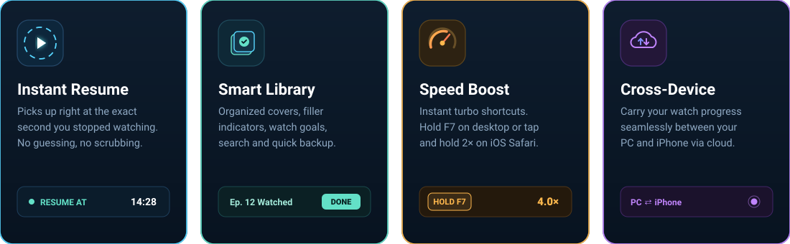
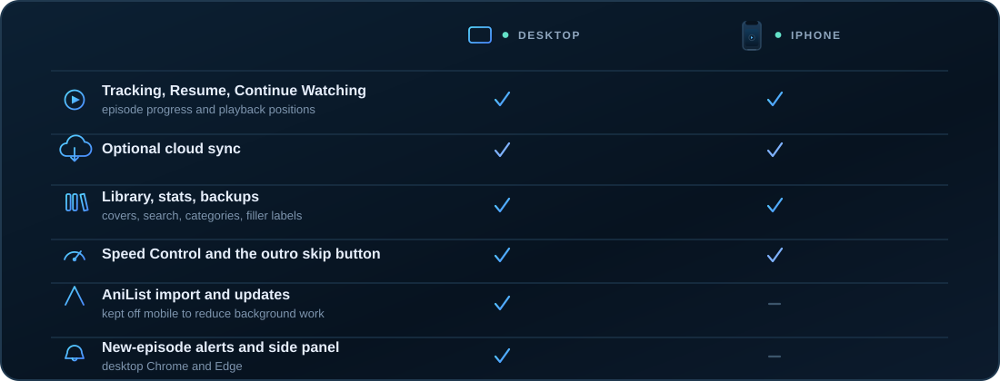

<div align="center">



<br>

<p align="center">
  <a href="CHANGELOG.md"></a>&nbsp;&nbsp;
  <a href="manifest.json"></a>&nbsp;&nbsp;
  <a href="PRIVACY.md"></a>
</p>

### Never lose your place. Watch, resume, and sync seamlessly.
<sub>Lightweight playback tracker &amp; library companion for Chrome, Edge, and Safari on iPhone</sub>

<br>

<p align="center">
  <a href="#install"></a>&nbsp;
  <a href="#features"></a>&nbsp;
  <a href="#speed-controls"></a>&nbsp;
  <a href="#platforms"></a>&nbsp;
  <a href="IOS.md"></a>&nbsp;
  <a href="CHANGELOG.md"></a>
</p>

</div>


<br>

<a id="features"></a>
<div align="center">

## ✨ Features



</div>

<br>

- ⏱ **Exact-Second Resume** — Remembers your precise timestamp. Click any episode in *Continue Watching* and jump straight back into the action.
- 🎯 **Smart Auto-Tracking** — Marks episodes as watched once you reach 85% of playback, keeping your watchlist updated hands-free.
- 📚 **Full Anime Library** — Cover artwork, search, custom categories, watch counters, filler episode tags, and one-click JSON backup / restore.
- ⚡ **Instant Speed Boost** — Hold <kbd>F7</kbd> on PC or tap and hold on iPhone for instant turbo playback with pitch correction.
- ⏭ **Outro Auto-Skip** — Powered by AniSkip to smoothly skip ending credits and move to the next episode.
- ☁️ **Cross-Device Sync** — Optional Firebase cloud sync carries your exact library and resume points between desktop and mobile. 100% functional offline or without an account.

<br>


<br>

<a id="platforms"></a>
<div align="center">

## 📱 Platforms



</div>

<br>


<br>

<a id="install"></a>
<div align="center">

## ⚡ Quick Install

</div>

### 💻 Desktop (Chrome / Edge / Brave)

1. [**Download the repo archive**](https://github.com/thomasthanos/An1me-Tracker/archive/refs/heads/main.zip) and unzip it into a permanent folder.
2. Go to `chrome://extensions` or `edge://extensions` and enable **Developer mode** (top-right toggle).
3. Click **Load unpacked** and select the folder containing `manifest.json`.
4. Pin the extension icon and open [an1me.to](https://an1me.to) to begin tracking!

---

### 📱 iPhone (Safari via SideStore)

> Compatible with **iOS 18+**. Runs as a native Safari Web Extension inside an unsigned IPA wrapper.

<div align="center">

Add the official source in **SideStore → Sources → +**:

```text
https://github.com/thomasthanos/An1me-Tracker/releases/download/tracker-source/source.json
```

Or download the prebuilt IPA directly:  
[**Download An1meTracker-8.2.1.ipa**](https://github.com/thomasthanos/An1me-Tracker/releases/download/tracker-v8.2.1/An1meTracker-8.2.1.ipa)

For step-by-step instructions with screenshots, read the **[iPhone Setup Guide (IOS.md)](IOS.md)**.

</div>

<br>


<br>

<a id="speed-controls"></a>
<div align="center">

## 🚀 Speed Controls

Integrated player speed boost designed for quickly skimming recaps or pacing your watch.

| Action | Desktop (Chrome / Edge) | iPhone Safari |
| :--- | :---: | :---: |
| **Instant Turbo Boost** | Hold <kbd>F7</kbd> *(default 4×)* | Hold player speed button for **2×** |
| **Toggle Boost** | Press <kbd>F8</kbd> | Tap button to return |
| **Speed Selection** | 1.5× · 2× · 3× · 4× · 8× | 1× · 1.25× · 1.5× · 2× |
| **Audio Memory** | Remembers local volume & mute | Handled natively by iOS |

</div>

<br>


<br>

<div align="center">

## 🛠️ Development & Builds

Zero build step required for desktop. Written in clean, vanilla modern JavaScript.

</div>

```text
manifest.json       Browser entry point and extension permissions
background.js       MV3 background service worker (sync, alarms, storage)
popup.html          Main library UI, search, and settings dashboard
src/                Modular scripts: content, player hooks, cloud, common utils
dev/                Development files, kept out of the extension bundle
  scripts/          Packaging and native iOS packaging utilities
  test/             Automated regression test suite
  screenshots/      Store and documentation screenshots
```

```sh
# Package clean release archives into dist/
node dev/scripts/package.js --zip                  # Desktop Chrome/Edge bundle
node dev/scripts/package.js --target safari --zip  # Safari iOS bundle
```

<div align="center">

Run the automated test suite (**PowerShell**):

```powershell
Get-ChildItem dev/test -Filter '*.test.js' | ForEach-Object { node $_.FullName }
```

</div>

<br>


<br>

<a id="privacy"></a>
<div align="center">

## 🔒 Privacy & Permissions

Report suspected vulnerabilities privately using the process in [SECURITY.md](SECURITY.md).
The repository uses CodeQL, Dependabot and secret scanning.



<br><br>

<p align="center">
  <a href="PRIVACY.md"></a>&nbsp;&nbsp;
  <a href="LICENSE"></a>
</p>

<br>

<sub>
<b>Source-available project</b> · Personal use and code review permitted under the <a href="LICENSE">License</a>.<br>
Independent extension not affiliated with an1me.to, AniList, MyAnimeList, or Google.
</sub>

</div>
