<div align="center">

<picture>
  <source media="(max-width: 600px)" srcset=".github/assets/readme/hero-mobile.svg">
  
</picture>

<p>
  <a href="CHANGELOG.md"></a>
  <a href="manifest.json"></a>
  <a href="PRIVACY.md"></a>
</p>

### Your next episode, already waiting.

Track what you watch. Resume at your saved timestamp.  
Keep your anime library with you, on desktop and iPhone.

<p>
  <a href="https://github.com/thomasthanos/An1me-Tracker/archive/refs/heads/main.zip"></a>
  <a href="IOS.md"></a>
</p>

<p>
  <a href="#features"></a>
  <a href="#platforms"></a>
  <a href="#speed-controls"></a>
  <a href="CHANGELOG.md"></a>
  <a href="PRIVACY.md"></a>
</p>

</div>

<a id="features"></a>

## Built around your watchlist

<p align="center">
  
  
  
  
  
  
</p>

**Watch → save → come back.** Open [an1me.to](https://an1me.to), play an episode and let the tracker save your progress. Continue Watching brings you back to your saved timestamp; episodes become watched at 85% playback.

<details>
<summary><b>Explore the library &amp; device features</b></summary>

- **Your collection:** cover artwork, search, custom categories, episode counters and filler tags.
- **Your progress:** saved playback positions, watch statistics, goals and JSON backup / restore.
- **Your player:** integrated speed boost and AniSkip outro skipping.
- **Your devices:** optional Firebase library and resume sync; desktop AniList integration and new-episode alerts.

The tracker works locally without an account. Metadata lookups still contact the providers listed in [Privacy](PRIVACY.md). AniList is disabled on mobile to save battery; episode alerts and the side panel are desktop features.

</details>

<a id="install"></a>

## Choose your setup

**Desktop:** Chrome, Edge or Brave. **iPhone:** Safari on iOS 18+, through SideStore with a free Apple ID.

<details>
<summary><b>💻 Desktop — install in four steps</b></summary>

1. [Download the archive](https://github.com/thomasthanos/An1me-Tracker/archive/refs/heads/main.zip) and unzip it into a permanent folder.
2. Open `chrome://extensions` or `edge://extensions` and enable **Developer mode**.
3. Choose **Load unpacked** → the folder containing `manifest.json`.
4. Pin the extension and open [an1me.to](https://an1me.to).

Desktop needs no build step. Keep the extracted folder in place so the browser can keep loading the extension.

</details>

<details>
<summary><b>📱 iPhone — SideStore source &amp; IPA</b></summary>

Follow the [iPhone setup guide](IOS.md) to install SideStore, enable the Safari extension and allow its website access.

Add this URL in **SideStore → Sources → +**:

```text
https://github.com/thomasthanos/An1me-Tracker/releases/download/tracker-source/source.json
```

[Download An1meTracker-8.2.3.ipa](https://github.com/thomasthanos/An1me-Tracker/releases/download/tracker-v8.2.3/An1meTracker-8.2.3.ipa) · [All releases](https://github.com/thomasthanos/An1me-Tracker/releases)

The source URL is for **Add Source**; the IPA is for **My Apps → +**. Keep LocalDevVPN connected while installing or refreshing.

If you use Google sign-in on desktop, set a password in **Settings → Set password for mobile**, then use email and password on iPhone.

</details>

## More to explore

<a id="platforms"></a>

<details>
<summary><b>Platforms — desktop &amp; iPhone capabilities</b></summary>

| Capability | Desktop | iPhone Safari |
| :--- | :--- | :--- |
| Episode tracking & resume | Yes | Yes |
| Optional cloud sync | Yes | Yes |
| Library, search, backups & stats | Yes | Yes |
| Speed controls | Hotkeys, up to 8× boost | Touch controls, up to 2× |
| AniSkip outro skip | Yes | Yes |
| AniList integration | Yes | Disabled to save battery |
| New-episode alerts & side panel | Yes | Unavailable |
| Account sign-in | Google or email | Email & password |

If you use Google on desktop, set a password under **Settings → Set password for mobile** before signing in on iPhone.

</details>

<a id="speed-controls"></a>

<details>
<summary><b>Speed controls — shortcuts &amp; playback preferences</b></summary>

| Action | Desktop | iPhone Safari |
| :--- | :--- | :--- |
| Temporary boost | Hold <kbd>F7</kbd> · default 4× | Hold speed button · 2× |
| Toggle / restore | Press <kbd>F8</kbd> | Tap to choose; release a hold to restore |
| Speed choices | 1.5× · 2× · 3× · 4× · 8× boost | 1× · 1.25× · 1.5× · 2× |
| Volume & mute | Remembered locally | iOS controls |

Configure or disable the feature in **Settings → Speed Control**. Choose a speed before opening Safari's native fullscreen, which uses its own controls. [iPhone playback details](IOS.md#speed-control)

</details>

<details>
<summary><b>Development — structure, packaging &amp; checks</b></summary>

Desktop needs no build step; the extension uses vanilla JavaScript.

```text
manifest.json   Browser entry point and permissions
background.js   MV3 service worker: sync, alarms, storage
popup.html      Library and settings UI
src/            Content scripts, player hooks, cloud and shared modules
dev/scripts/    Packaging, iOS utilities and documentation artwork
dev/test/       Regression tests
dev/screenshots/ Store and documentation screenshots
```

```sh
node dev/scripts/package.js --zip
node dev/scripts/package.js --target safari --zip
node dev/scripts/build-hero.js  # Regenerate all documentation SVGs from manifest.json
```

Run regression tests on **PowerShell**:

```powershell
Get-ChildItem dev/test -Filter '*.test.js' | ForEach-Object { node $_.FullName }
```

Or on **Bash**:

```sh
for test in dev/test/*.test.js; do node "$test" || exit 1; done
```

</details>

<a id="privacy"></a>

## Local first. Your choice to sync.

Your library stays on your device unless you enable cloud sync. No analytics or advertising SDK. Metadata requests and data controls are explained in the [privacy policy](PRIVACY.md).

<p align="center">
  <a href="https://github.com/thomasthanos/An1me-Tracker/issues">Report a bug</a> ·
  <a href="SECURITY.md#reporting-a-vulnerability">Report a vulnerability privately</a> ·
  <a href="LICENSE">License</a>
</p>

<p align="center"><sub>Made by <a href="https://github.com/thomasthanos">ThomasThanos</a> · Source available for personal use and code review under the license.<br>Independent project; not affiliated with an1me.to, AniList, MyAnimeList or Google.</sub></p>
