<p align="center">
  
</p>

<p align="center"><a href="../../../README.md">Overview</a> · <a href="../../../IOS.md">iPhone</a> · <a href="../../../CHANGELOG.md">Changelog</a> · <a href="../../../PRIVACY.md">Privacy</a> · <a href="../../../SECURITY.md">Security</a></p>

# iOS icon design — 8.1.0

Keep the recognisable T and the anime character, with the same silhouette and composition across appearances. Native `AppIcon.icon` uses a transparent portrait layer and system-rendered Liquid Glass. With the native icon active, Xcode generates flat icons for older iOS releases from that artwork. Light, dark and tinted PNGs are retained for catalog-only builds; `AppIcon-glass.png` is an exported design preview, not a separate catalog appearance. The system chooses Clear and the user's tint from the native icon.

Generated with the built-in `image_gen` tool; resized to 1024×1024 only for Xcode asset export. Desktop extension icons are unchanged.

Assets: `AppIcon-light.png`, `AppIcon-dark.png`, `AppIcon-glass.png`, `AppIcon-tinted.png`, `AppIcon-transparent.png`, and `AppIcon.icon/Assets/TrackerPortrait.png`.

## SideStore listing artwork

`AppIcon-sidestore.svg` composes the native icon's light background (`#f5fbff` to `#cee3f4`, from `AppIcon.icon/icon.json`) and the unchanged `TrackerPortrait.png` layer. The background is vector artwork; the portrait is an embedded raster PNG. The self-contained SVG can be rendered without resolving external files. `AppIcon-sidestore.png` is its opaque, full-bleed 1024×1024 RGB export for SideStore's native image decoder. It does not bake in rounded corners or replace the native app icons.

Export deterministically with Sharp from the tracker directory:

```js
const fs = require("node:fs");
const sharp = require("sharp");
sharp(fs.readFileSync("src/icons/ios/AppIcon-sidestore.svg"))
  .removeAlpha()
  .png({ compressionLevel: 9, adaptiveFiltering: false })
  .toFile("src/icons/ios/AppIcon-sidestore.png");
```

Both the app listing and source badge use that PNG at the `tracker-v<version>` GitHub tag, so a release changes the URL and does not reuse cached artwork from `main`. Publish a new version tag containing the assets; an existing tag cannot serve artwork added after that tag. SideStore renders the small circle beside the app title as its source badge; the large installed-app icon comes from the IPA. Source metadata controls the badge image and listing text/tint, while SideStore owns its layout and the installed icon's display. Native light, dark, Clear and user-tinted appearances continue to use `AppIcon.icon`.

[SideStore app metadata](https://sidestore.io/sidestore-source-types/interfaces/App.html) · [SideStore source badge implementation](https://github.com/SideStore/SideStore/blob/develop/AltStore/Components/AppBannerView.swift)

## Prompt set

<details>
<summary><b>Foreground &amp; appearance prompts</b></summary>

Foreground: Edit the existing T portrait into a polished production foreground layer. Keep the bold uppercase T and the serious spiky dark-haired anime young man inside it, monochrome face and clothing, cyan eye and outline. Cleaner outline, softer corners and fewer scratch marks. No heavy neon bloom or baked glass reflections. Transparent background with no app tile, background or outer mask. Keep this geometry across all appearances.

Common variant prompt:

Use case: identity-preserve. Edit target: the supplied transparent T portrait. Asset type: production square iOS app icon for An1me Tracker. Keep exactly the same T silhouette, anime man's face, hairstyle, gaze, black-and-white facial detail, placement, crop, scale and cyan eye/outline (except tinted variant). Change only the background and subtle material treatment. Output a single full-bleed opaque square icon, 1024x1024 preferred, without rounded outer corners, no text, no border around the canvas, no extra symbols or objects. The portrait should be crisp and readable at small size. Restrained premium iOS glass styling, avoid excessive neon glow, glitter, noisy wallpaper, heavy drop shadows.

**light**: Light appearance: soft pearl-white to very pale cool-gray background. Subtle blue-gray ambient depth behind the T. Preserve strong dark hair and crisp pale face, slim cyan rim and eyes. Refined, clear and airy.

**dark**: Dark appearance: deep midnight-navy to near-black background. Subtle cool light at the upper edge of the T, calm dimensional material. Keep the T and portrait crisp with restrained cyan rim/eyes. No diffuse neon halo.

**glass**: Clear/glass appearance preview: pale cool blue-gray frosted glass background with very subtle translucent depth and broad smooth lighting. T has a delicate polished silver/cyan bevel, preserve anime linework. Elegant clear glass look, no sparkle or distracting reflections.

**tinted**: Tinted appearance source: fully grayscale, absolutely no cyan or colored pixels. Charcoal to black background, bright silver/white T edge, eyes in white-gray, retain the identical anime portrait and T geometry. High-contrast monochrome luminosity source suitable for iOS user-selected tint, without adding a fixed colored tint.

</details>

[Apple: Creating your app icon using Icon Composer](https://developer.apple.com/documentation/xcode/creating-your-app-icon-using-icon-composer)

